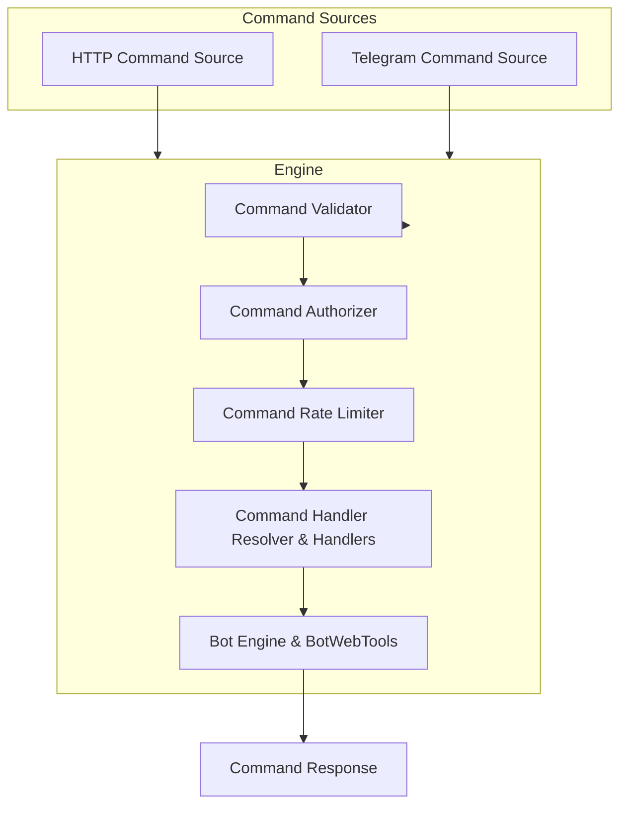
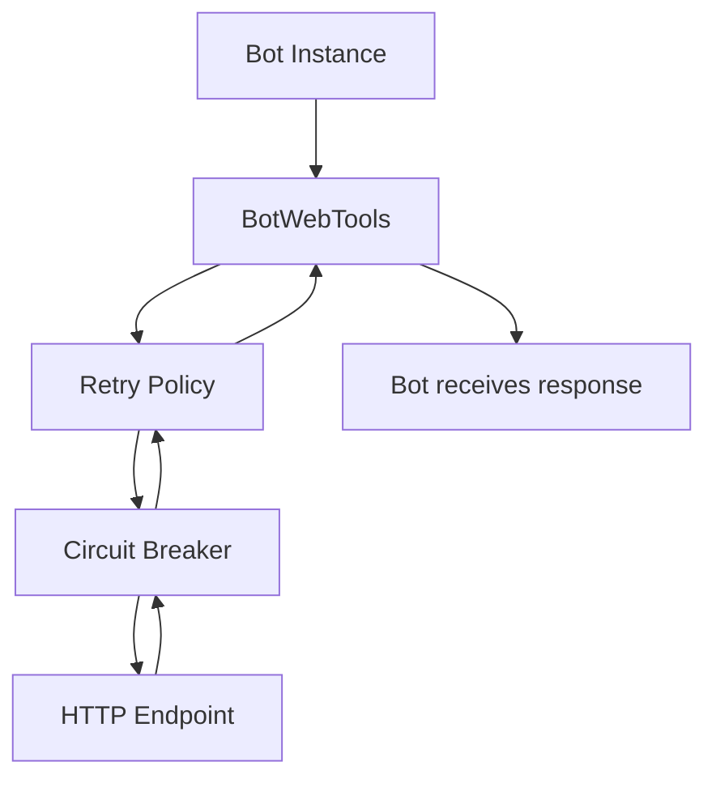

# Plankton Suite

Plankton is whatever I want it to be. This file will grow over time.

---

## Application Info

```json
{
  "name": "Plankton Host",
  "version": "1.0.0",
  "description": "This app is whatever I want it to be.",
  "author": "Isaac Candido",
  "year": "2026",
  "baseAddress": "https://isaaccandido.com/plankton"
}
```

---

## Startup Parameters

Startup parameters are defined declaratively in the application configuration (`appsettings.json`) under the `cli-options` section.

* Only HTTP and Telegram commands are active; CLI commands are for boot-time configuration only.
* Parameters are parsed at startup.
* Invalid or missing parameters fall back to defaults and emit warnings.
* `-h`, `--help`, or `-help` prints all available options and exits.

---

### Option Definition

Each parameter maps to a `CliOption`:

| Field                 | Description                             |
| --------------------- | --------------------------------------- |
| `Type`                | `flag`, `bool`, `int`, `string`, `enum` |
| `MinArgs` / `MaxArgs` | Minimum / maximum number of values      |
| `Required`            | Must be present?                        |
| `Default`             | Default value if missing                |
| `Help`                | Shown in `--help`                       |
| `Values`              | Allowed values (for `enum`)             |

---

### Example Configuration

```json
"cli-options": {
  "-input": { "type": "string", "minArgs": 1, "help": "One or more input files" },
  "-output": { "type": "string", "minArgs": 1, "maxArgs": 1, "required": true, "help": "Output file" },
  "-enable-scheduling": { "type": "bool", "default": false, "help": "Enables scheduling" },
  "-mode": { "type": "enum", "values": ["fast", "safe", "debug"], "default": "safe", "help": "Execution mode" }
}
```

---

### Help Output Example

```text
Available command line options:
-input               One or more input files
-output              Output file
-enable-scheduling   Enables scheduling
-mode                Execution mode
```

---

## Required Environment Variables

| Variable                | Description                                                              |
| ----------------------- | ------------------------------------------------------------------------ |
| `PLANKTON_ADMIN_TOKEN`  | Token used to authorize admin commands.                                  |
| `PLANKTON_BASE_ADDRESS` | Base address used by HTTP command responses (`application:baseAddress`). |

---

## Command Sources

Plankton currently supports two active command sources:

* **HTTP Command Source** – accepts JSON requests at `/command`.
* **Telegram Command Source** – accepts commands from Telegram bots.

Other command sources (CLI) are only used for startup parameters.

---

## Bot Engine

The Bot Engine manages all registered bots and supports the following:

* Start, stop, restart, enable, disable bots individually or in bulk
* Tracks status (`Idle`, `Running`, `Disabled`, `Crashed`, `Stopped`, `PermanentlyStopped`)
* Tracks crash counts and next scheduled run
* Provides full status model (`BotFullStatusModel`) with reason messages
* Logs bot operations with the bot class name
* Thread-safe concurrent management
* Supervises each bot with automatic restart, crash detection, and delays

---

### Bot Lifecycle Operations

| Method             | Description                                         |
| ------------------ | --------------------------------------------------- |
| `StartBot(name)`   | Starts a bot if not already running or disabled     |
| `StopBot(name)`    | Stops a running or idle bot                         |
| `RestartBot(name)` | Stops and starts a bot                              |
| `EnableBot(name)`  | Marks a bot as enabled and starts it if not running |
| `DisableBot(name)` | Marks a bot as disabled and stops it                |
| `StartAll()`       | Starts all bots                                     |
| `StopAll()`        | Stops all bots                                      |
| `RestartAll()`     | Restarts all bots                                   |

---

### Bot Status Model

```json
{
  "name": "TestBot",
  "status": "Disabled",
  "crashCount": 0,
  "isRunning": false,
  "settings": {
    "enabled": false,
    "runInterval": "00:00:05",
    "maxFailures": 3,
    "restartDelay": "00:00:10"
  },
  "nextRun": null,
  "reason": "Bot is disabled in settings"
}
```

* `status` is serialized as an enum string
* `nextRun` shows the next scheduled execution
* `reason` explains why a bot is in its current state

---

## BotWebTools HTTP Utilities

`BotWebTools` is a singleton utility class for HTTP interactions for bots. Features:

* Sends HTTP requests with per-bot configuration
* Supports **Bearer Token** and **Basic Auth**
* Supports custom headers
* Automatic **idempotency** for POST requests
* **Retry** with configurable count and delay
* **Circuit breaker** per host
* Logs all requests and responses with bot ID and class name
* Fully thread-safe for concurrent bot operations

---

### Example Usage

```csharp
var response = await botWebTools.SendAsync<MyResponse>(
    "https://api.example.com/endpoint",
    HttpMethod.Post,
    botId: "TestBot",
    body: new { Foo = "Bar" },
    ct: CancellationToken.None
);

botWebTools.ResetIdempotencyToken("TestBot");
```

---

### AppSettings Example

```json
"BotsHttpSettings": {
  "Default": {
	"BaseUrl": "http://test.com",
    "BearerToken": "",
    "BasicAuth": { "UserName": "defaultUser", "Password": "defaultPass" },
    "RetryCount": 3,
    "RetryDelaySeconds": 2,
    "CircuitBreakerFailures": 5,
    "CircuitBreakerDurationSeconds": 30
  },
  "Bots": {
    "TestBot": {
      "BearerToken": "token-for-testbot",
      "RetryCount": 5,
      "CircuitBreakerFailures": 3
    },
    "AnotherBot": {
      "BasicAuth": { "UserName": "bot2", "Password": "pass2" }
    }
  }
}
```

---

## Command Flow



1. Commands arrive from HTTP or Telegram.
2. **Validator** checks command name, minimum args, fixed args.
3. **Authorizer** validates the token.
4. **Rate Limiter** ensures per-command limits.
5. **Handlers** execute commands.
6. **Bot Engine & BotWebTools** manage bot execution, HTTP calls, retries, and logging.
7. Response is returned in structured JSON.

---

## Command Response Structure

Successful command responses use JSON objects with optional metadata:

```json
{
  "availableCommands": {
    "list-commands": {
      "minimumArgsCount": 0,
      "possibleArguments": [],
      "description": "Lists all available commands."
    },
    "start-bot": {
      "minimumArgsCount": 1,
      "possibleArguments": ["bot1","bot2"],
      "description": "Starts a bot or multiple bots by name."
    }
  }
}
```

---

## Error Handling

HTTP and Telegram responses follow **Problem+JSON** RFC 7807:

```json
{
  "status": 400,
  "title": "Invalid command",
  "type": "https://isaaccandido.com/plankton/problems/invalid-command",
  "detail": "Command 'start-bot' requires at least 1 argument. Allowed: bot1, bot2",
  "instance": "/command"
}
```

* **Correlation ID** is always added: `X-Correlation-Id`.
* Error types:

  * `InvalidCommandException` → 400
  * `UnauthorizedCommandException` → 401
  * `RateLimitExceededException` → 429
  * Other exceptions → 500

---

## Dynamic Base Address

* Read from `PLANKTON_BASE_ADDRESS` at startup.
* Used in all Problem+JSON `type` URIs.

---

This README now fully reflects:

* Bot lifecycle and supervision
* Full bot status with reason messages
* Thread-safe concurrent operations
* HTTP utilities (`BotWebTools`) with auth, headers, retry, circuit breaker, idempotency
* Configurable per-bot via `appsettings.json`
* Logging with bot class names
* All previous command validation, CLI options, and error handling

---

## BotWebTools HTTP Flow Diagram


