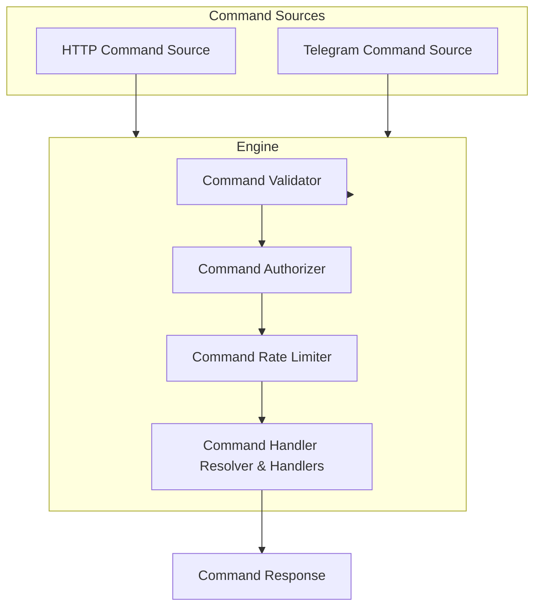

# Plankton Suite

Plankton is whatever I want it to be. This file will grow over time.

---

## Application Info

```json
{
  "name": "Plankton Host",
  "version": "1.0.0",
  "description": "This app is whatever I want it to be.",
  "author": "Isaac Candido",
  "year": "2026",
  "baseAddress": "https://isaaccandido.com/plankton"
}
```

---

## Startup Parameters

Startup parameters are defined declaratively in the application configuration (`appsettings.json`) under the `cli-options` section.

* **Only HTTP and Telegram commands are active**; CLI commands are for boot-time configuration only.
* Parameters are parsed at startup.
* Invalid or missing parameters fall back to defaults and emit warnings.
* `-h`, `--help`, or `-help` prints all available options and exits.

---

### Option Definition

Each parameter maps to a `CliOption`:

| Field                 | Description                             |
| --------------------- | --------------------------------------- |
| `Type`                | `flag`, `bool`, `int`, `string`, `enum` |
| `MinArgs` / `MaxArgs` | Minimum / maximum number of values      |
| `Required`            | Must be present?                        |
| `Default`             | Default value if missing                |
| `Help`                | Shown in `--help`                       |
| `Values`              | Allowed values (for `enum`)             |

---

### Example Configuration

```json
"cli-options": {
  "-input": { "type": "string", "minArgs": 1, "help": "One or more input files" },
  "-output": { "type": "string", "minArgs": 1, "maxArgs": 1, "required": true, "help": "Output file" },
  "-enable-scheduling": { "type": "bool", "default": false, "help": "Enables scheduling" },
  "-mode": { "type": "enum", "values": ["fast", "safe", "debug"], "default": "safe", "help": "Execution mode" }
}
```

---

### Help Output Example

```text
Available command line options:
-input               One or more input files
-output              Output file
-enable-scheduling   Enables scheduling
-mode                Execution mode
```

---

## Required Environment Variables

| Variable                | Description                                                              |
| ----------------------- | ------------------------------------------------------------------------ |
| `PLANKTON_ADMIN_TOKEN`  | Token used to authorize admin commands.                                  |
| `PLANKTON_BASE_ADDRESS` | Base address used by HTTP command responses (`application:baseAddress`). |

---

## Command Sources

Plankton currently supports two active command sources:

* **HTTP Command Source** – accepts JSON requests at `/command`.
* **Telegram Command Source** – accepts commands from Telegram bots.

Other command sources (CLI) are only used for startup parameters.

---

## Command Flow



1. Commands arrive from HTTP or Telegram.
2. **Validator** checks:

   * Command name exists
   * Minimum args met
   * Fixed args (if any) match
3. **Authorizer** validates the token.
4. **Rate Limiter** ensures per-command limits are enforced.
5. **Handlers** execute commands and produce structured responses.

---

## Command Response Structure

Successful command responses use JSON objects with optional metadata:

```json
{
  "availableCommands": {
    "list-commands": {
      "minimumArgsCount": 0,
      "possibleArguments": [],
      "description": "Lists all available commands."
    },
    "start-bot": {
      "minimumArgsCount": 1,
      "possibleArguments": ["bot1","bot2"],
      "description": "Starts a bot or multiple bots by name."
    }
  }
}
```

* `possibleArguments` appears only if the command has fixed arguments.
* `description` appears only if defined for the command.

---

## Error Handling

HTTP and Telegram responses follow **Problem+JSON** RFC 7807:

```json
{
  "status": 400,
  "title": "Invalid command",
  "type": "https://isaaccandido.com/plankton/problems/invalid-command",
  "detail": "Command 'start-bot' requires at least 1 argument. Allowed: bot1, bot2",
  "instance": "/command"
}
```

* **Correlation ID** is always added to response headers: `X-Correlation-Id`.
* Error types:

  * `InvalidCommandException` → 400
  * `UnauthorizedCommandException` → 401
  * `RateLimitExceededException` → 429
  * Other exceptions → 500

---

## Dynamic Base Address

* Read from `PLANKTON_BASE_ADDRESS` at startup.
* Used in all Problem+JSON `type` URIs.

---

This README reflects all implemented features:

* Command validation & fixed args
* Optional descriptions
* Unique bot names normalization
* HTTP & Telegram command sources
* CLI configuration only at startup
* Dynamic base address
* Error handling with correlation IDs
* Mermaid flow diagram
