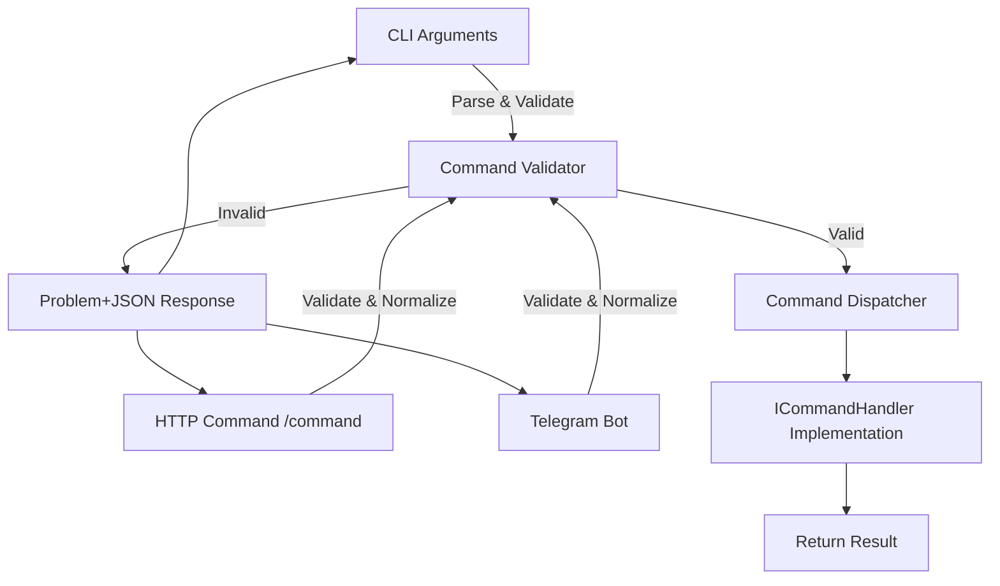

# Plankton Suite

Plankton is whatever I want it to be. This file will grow over time.

It’s a modular host application with CLI, HTTP, and Telegram command sources, command validation, authorization, rate limiting, and dynamic command discovery.

---

## Startup Parameters

Startup parameters are defined declaratively in the application configuration file (`appsettings.json`). Each parameter is described using a key-value structure, where the key is the command-line option name (e.g. `-input`) and the value defines how that option behaves.

At runtime:

* The application reads all available options from configuration.
* Command-line arguments are parsed and validated against those options.
* Invalid or missing values fall back to defaults and emit warnings.
* Passing `-h`, `--help`, or `-help` prints all available options and exits.

Only options declared in configuration are recognized.

---

### Option Definition

Each startup parameter maps to a `CliOption` definition with the following fields:

* **Type**  
  The option type. Supported values:

    * `flag` – presence-only switch (no values)  
    * `bool` – `true` / `false`  
    * `int` – integer value  
    * `string` – one or more string values  
    * `enum` – one value from a predefined list

* **MinArgs / MaxArgs**  
  Minimum and maximum number of values the option accepts (applies to `string` and `enum`).

* **Required**  
  Whether the option must be present at startup.  

* **Default**  
  Value used when the option is omitted or invalid.  

* **Help**  
  Short description shown when `--help` is requested.  

* **Values**  
  Allowed values for `enum` options.

---

### Example Configuration

```json
"cli-options": {
  "-input": {
    "type": "string",
    "minArgs": 1,
    "help": "One or more input files"
  },
  "-output": {
    "type": "string",
    "minArgs": 1,
    "maxArgs": 1,
    "required": true,
    "help": "Output file"
  },
  "-enable-scheduling": {
    "type": "bool",
    "default": false,
    "help": "Enables scheduling"
  },
  "-mode": {
    "type": "enum",
    "values": ["fast", "safe", "debug"],
    "default": "safe",
    "help": "Execution mode"
  }
}
```

---

### Available Command Sources

Plankton can receive commands from multiple sources. Each source can be enabled or disabled in `appsettings.json`:

```json
"commandSources": {
  "httpEnabled": true,
  "telegramEnabled": false
}
```

* **HTTP** – receives commands via a REST endpoint (`/command`)  
* **Telegram** – receives commands via a Telegram bot integration  

At least **one source must be enabled**, otherwise the application will fail to start.

---

### Command Validation & Handling

Plankton enforces strict command validation:

* **Required arguments** – commands must include at least the minimum number of arguments.
* **Fixed arguments** – if defined, only allowed values are accepted.  
* **Open arguments** – commands without fixed arguments can accept any values.
* **Description** – commands can include a human-readable description.
* **Argument normalization** – arguments are trimmed and converted to lowercase for consistency.
* **Unique arguments** – duplicate arguments in the same payload are ignored.

All invalid commands raise a **domain exception**, returned to the client as structured JSON following the [RFC 7807 problem+json](https://datatracker.ietf.org/doc/html/rfc7807) format.

Example error response:

```json
{
  "status": 400,
  "title": "Invalid command",
  "type": "https://isaaccandido.com/plankton/problems/invalid-command",
  "detail": "Invalid argument 'foo' for command 'test'. Allowed: a, b",
  "instance": "/command",
  "correlationId": "1a2b3c4d5e6f7g"
}
```

---

### Built-in Command Features

* **Dynamic discovery** – all registered `ICommandHandler` implementations are automatically available.  
* **`list-commands`** – lists all commands with their minimum argument count, possible fixed arguments, and description (if defined).  
* **Unique argument normalization** – commands like `start-bot` normalize input arguments to lowercase and trim whitespace, ensuring duplicates are ignored.  
* **Rate limiting** – optional command rate limiting to prevent abuse.  
* **Authorization** – commands can require a valid admin token for execution.  

Example `list-commands` response:

```json
{
  "availableCommands": {
    "start-bot": {
      "minimumArgsCount": 1,
      "possibleArguments": ["bot1", "bot2"],
      "description": "Starts a bot or multiple bots by name."
    },
    "list-commands": {
      "minimumArgsCount": 0,
      "description": "Lists all available commands."
    }
  }
}
```

---

### Help Output Example

```text
Available command line options:
-input               One or more input files
-output              Output file
-enable-scheduling   Enables scheduling
-mode                Execution mode
```

---

### Logging

* All logs use **Serilog**.  
* JSON responses and structured logs are supported.  
* Errors and exceptions include a **correlation ID** to trace requests across systems.  
* Domain exceptions are caught and formatted as structured problem+json responses for HTTP and Telegram clients.

---

### Command Flow Diagram



---

### Summary

Plankton is a flexible, modular host that:

* Reads declarative CLI options from configuration.  
* Validates user input and command payloads with detailed rules.  
* Supports multiple command sources with runtime enable/disable.  
* Automatically documents available commands and arguments.  
* Handles errors gracefully with structured logging and JSON problem responses.  

This README grows alongside the application and its features.

